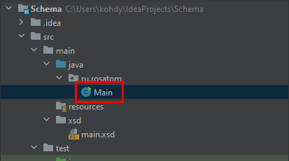

# Реализация XSD-схемы

## Развёртывание проекта:

```shell
git clone https://github.com/Ossowitz/ParseTaskRosatom.git
```

## Запуск проекта:

```shell
mvn clean install
```

## Опционально воспользоваться Docker:

```dockerfile
FROM maven:3.8.3-openjdk-17-slim

WORKDIR /app

COPY . /app

RUN mvn clean install

CMD ["echo", "Maven build completed successfully"]
```

### [Созданная XSD-схема:](https://github.com/Ossowitz/ParseTaskRosatom/blob/master/src/main/xsd/main.xsd)


### [Сгенерированные на основе XSD-схемы Java-классы:](https://github.com/Ossowitz/ParseTaskRosatom/tree/master/target/generated-sources/jaxb/ru/rosatom)


### [Эталонные запросы и ответы](https://github.com/Ossowitz/ParseTaskRosatom/blob/master/src/main/java/ru/rosatom/Main.java)

